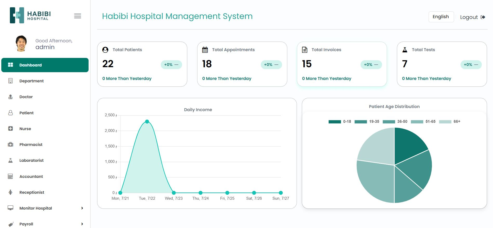
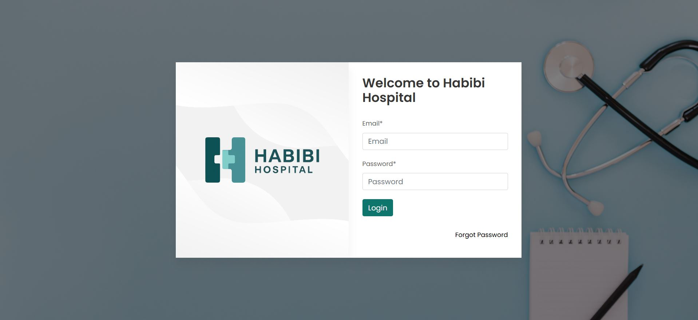

# 🏥 Habibi Hospital Management System (Demo Repository)

Welcome to the **Habibi Hospital Management System (HMS)** – a comprehensive, web-based platform built to streamline hospital operations and improve the efficiency of healthcare workflows. This project was developed using **PHP (CodeIgniter framework)**, with a focus on multi-role access control, appointment scheduling, billing, pharmacy management, and more.

> ⚠️ **Note:** This is a **portfolio/demo repository** showcasing the features and structure of the Habibi HMS project. The actual source code is **not included** for licensing and security reasons.

If you're interested in seeing the full working version or collaborating on the project, feel free to contact me:  
📧 **shahreyarhabibi@gmail.com**

---

## 📌 Project Highlights

Habibi HMS is designed with usability, security, and modularity in mind. It supports the full cycle of hospital operations with distinct role-based access for medical and administrative staff.

### 🔐 Supported User Roles

| Role         | Description                                                       |
|--------------|-------------------------------------------------------------------|
| Admin        | Full control of system settings, user roles, and hospital modules |
| Doctor       | Manage appointments, view and update patient medical records      |
| Patient      | Book appointments, view prescriptions, history, and invoices      |
| Accountant   | Handle payments and billing operations                            |
| Nurse        | Manage ward details, assist in patient tracking                   |
| Receptionist | Schedule and manage appointments and admissions                   |
| Pharmacist   | Manage medicine inventory and prescriptions                       |

---

## 🛠️ Tech Stack

- **Backend**: PHP (CodeIgniter Framework)
- **Frontend**: HTML, CSS, Bootstrap, JavaScript
- **Database**: MySQL

---

## 🔐 Demo Logins

> Use the following sample logins to access each role:

| Role         | Email                                                     | Password     |
| ------------ | --------------------------------------------------------- | ------------ |
| Admin        | [admin@domain.com](mailto:admin@domain.com)               | admin        |
| Doctor       | [doctor@domain.com](mailto:doctor@domain.com)             | doctor       |
| Patient      | [patient@domain.com](mailto:patient@domain.com)           | patient      |
| Accountant   | [accountant@domain.com](mailto:accountant@domain.com)     | accountant   |
| Nurse        | [nurse@domain.com](mailto:nurse@domain.com)               | nurse        |
| Receptionist | [receptionist@domain.com](mailto:receptionist@domain.com) | receptionist |
| Pharmacist   | [pharmacist@domain.com](mailto:pharmacist@domain.com)     | pharmacist   |

---

## 🎯 Key Features

- ✅ Role-based authentication and access control
- 🗓️ Appointment booking and scheduling system
- 🧾 Invoicing and billing management
- 💊 Pharmacy and prescription tracking
- 🏥 Ward and bed allocation
- 🧑‍⚕️ Medical record management
- 🔒 Secure login and session management

---

## 🖼️ UI Previews

> Here are some example screenshots of the system UI:

  
    
  

---

## 📄 About This Repository

This repository is intended for **showcasing the features and design** of the Habibi HMS project only. It does not contain:

- Source code or business logic
- Configuration or database files
- Deployable or runnable code

If you are a recruiter, client, or collaborator interested in the full implementation:

📩 **Email:** [shahreyarhabibi@gmail.com](mailto:shahreyarhabibi@gmail.com)  
💼 LinkedIn: https://www.linkedin.com/in/ali-reza-habibi/

---

## 📘 License & Disclaimer

This project is **proprietary** and is not open-source. Unauthorized use, distribution, or reproduction of the actual system or its source code is prohibited.

You are welcome to contact the author for a **private demo** or collaboration.

---

## 🙏 Acknowledgments

Special thanks to the open-source communities behind:
- [CodeIgniter](https://codeigniter.com)
- [Bootstrap](https://getbootstrap.com)
- [Font Awesome](https://fontawesome.com)

---

> 👨‍💻 Developed with care by **Ali Reza Habibi**
